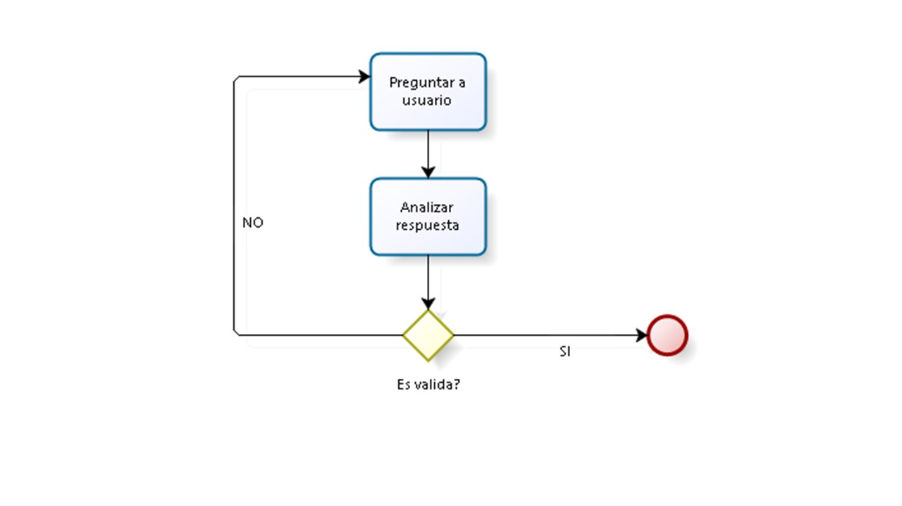

#2. Tarjeta de crédito válida
##/preguntar n al usuario número de tarjeta
##//pasar los numeros de un array en orden inverso
##//aplicar la operacion a los numeros de las posiciones pares(caracter/2=0) X*2 
##//if(X*2=> 10 ){ sumar los dígitos del resultado}
##// sumar los dígitos y nuevos dígitos ejem( 5 está en posición 8, por tanto 5*2= 10 => 1+0= 1)
## //luego sumar los numeros de posiciones impares con el nuevo número de las posiciones pares
## // comprobar si es una tarjeta válida
##// usuario no puede ingresar nº vacío
## //array (3 array uno nº de tarjeta, otro con orden inverso, 
## //3er con posiciones de los caracteres en orden inverso)
##// sumar todos los dígitos impares y resultado de pares, el resultado de esta suma
##// se divide por 10 y el residuo debe ser 0 (40 % 10= 0)
